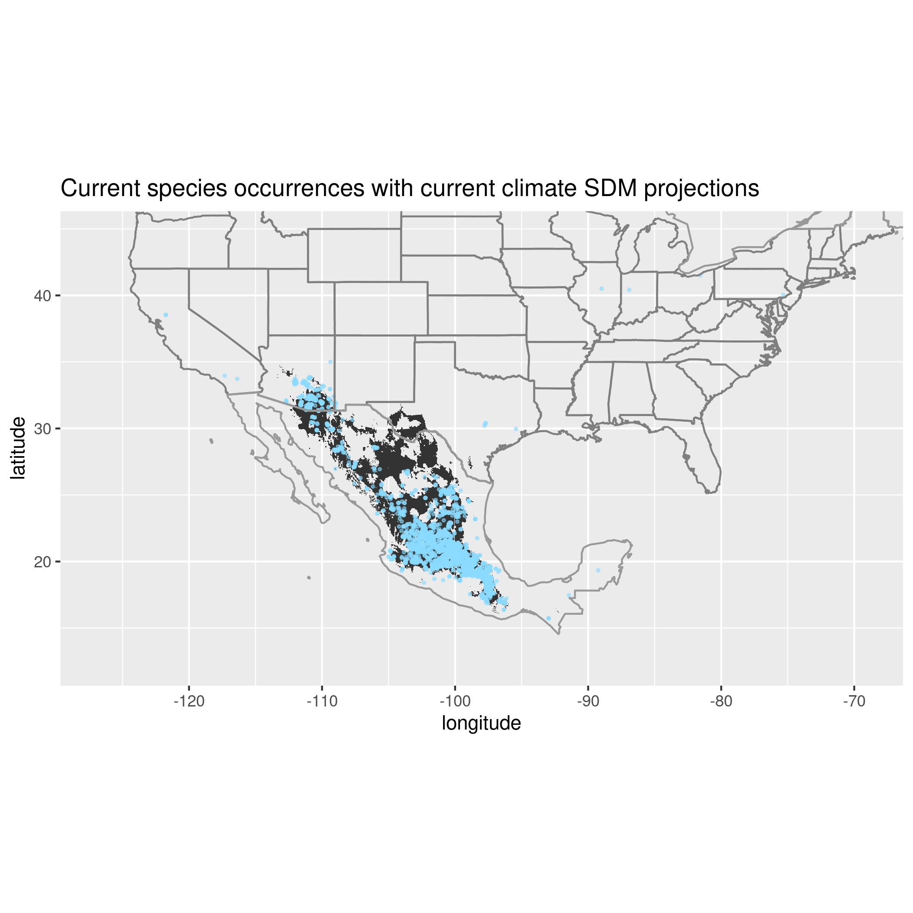

# Host Plant Information for Monarch (*Danaus plexippus: Nymphalidae*)

### Species Status Assessment by Moritz Kalis, Mila Pruiett, and Claire Joseph

## Species Name: Pineneedle milkweed *Asclepias linaria*

## Species Taxonomy:
- Kingdom: Plantae
- Phylum: Tracheophyta
- Class: Magnoliopsida
- Order: Gentianales
- Family: Apocynacea
- Genus: Asclepias
- Species: linaria

## Species Description:
*A. linaria* is a rare milkweed species in the US, but common and found throughout
Mexico. It can grow up to 4 feet tall, but is typically around 2 feet tall.
It flowers in the spring and summer annually. It has small, white flowers, woody stems, and needle-shaped leaves. Small plants are sometimes mistaken for juvenile pine trees. It is readily availble for commercial planting in the desert Southwest. 

## Habitat Description:
- Dry rocky slopes and mesas
- elevation: 1500-6000ft

## Larval Host Information:
It is known to be a host plant for monarch butterflies, Queen Butterflies (will feed on other wildflowers instead) and other pollinators. However, it is used only occasionally due to its relative toxicity (Nabhan et al., 2015). In a study comparing *A. linaria* with *A. angustifolia*, another native milkweed to Arizona, female monarchs preferred to lay on *A. angustifolia*, had greater larvae survival rates, faster larval development, and reached a larger adult size on *A. angustifolia*. However, this leaves many other milkweed species unevaluated, with uncertaintiy as to if *A. linaria* would be preferred compared with others (Pegram and Melkonoff, 2019). Additionally, unpublished data shows that five times more honeybees, *Apis mellifera*, visited *A. linaria* than *D. plexippus* (Pegram and Melkonoff, 2019). 

## Data Sources for Occurence and Distribution Modeling:
- GBIF
- iNaturalist

## Data cleaning
We removed all data that had
 - 0 or NA occurences
 - ABSENT occurence status
 - coordinates outside continental North America

## Species Occurence Map

 

#### Link to GitHub Repository [Here](https://github.com/BiodiversityDataScienceCorp/Pineneedles-main-repo)

## Species Distribution Model
### Description of SDM
- The Species Distribution Model map uses bioclim data with occurence data from 1950-2021 to show the areas that are most adept to supporting Pineneedle milkweed (*Asclepias linaria*). The orange displays the species occurence data (sourced from GBIF and iNaturalist). The grey represents the areas in which Pineneedle Milkweed could theoretically grow accordng to the areas climate.
### Methods for SDM
- To create the model we first ran the setup.R file in order to download the required packages in R studio (raster, sp, dismo, maptools, spocc) and the required climate, bioclim, and forcasting data to run the niche modeling predictions. Next, we copied "run-sdm-single.R" in the source directory and renamed it for our species (Pineneedle Milkweed) and changing the text in the appropriate spaces to descriptive names. After, we queried gbif for 'Asclepias linaria' and saved as a CSV file in data. Lastly, we ran the sdm single file that we customized which produced the species distribution model map. Thank you Jeff Oliver for the code to create the model.

### Description of Future SDM
- The Future Species Disribution Model map uses Worldclim forcast climate data for the year 2070 based on the GFDL-ESM2G model with an RCP of 4.5 CO2. The orange points represent the current species occurences for Pineneedle Milkweed for the years 1950-2020. The grey represents the Species Disripution Model projections for the year 2070.
### Methods for Future SDM
- Using forcast climate data from Worldclim and the GFDL-ESM2G model 

### Current and Future SDM in Arizona

## Summary and Key Findings
- Pineneedle Milkweed is mostly prevalent in Mexico and Southern Arizona
- With climate predictions for 2070, the range for the milkweed moves a bit farther north into Arizona and Texas
- The species may become more prevalent in Monarch Butterfly Migration even if it is not a preferential species for laying eggs because of its relative heat tolerance in relation to a warming planet
- With climate change, we might witness range contraction to higher elevations

#### Link to Github Repository [Here](https://github.com/BiodiversityDataScienceCorp/Pineneedles-main-repo)

###### References:
Nabhan, G., S. Buckley, and H. Dial. 2015. Pollinator Plants of the Desert Southwest: Native
Milkweeds (Asclepias spp.). USDA-Natural Resources Conservation Service, Tucson Plant
Materials Center, Tucson, AZ. TN-PM-16-1-AZ. 

Pegram, Kimberly V, and Natalie A Melkonoff. "Assessing Preference and Survival of Danaus Plexippus on Two Western Species of Asclepias." Journal of Insect Conservation 24, no. 2 (2019): 287-95.
